# Vista-IQ

Vista-IQ is a full-stack AI career preparation platform. It combines resume analysis, AI interview practice, coding preparation, job matching, job-market search, roadmap generation, and profile management in one React + FastAPI application.

## Features

- JWT authentication with refresh tokens and optional Google OAuth
- AI interview practice with company-specific preparation flows
- Resume upload, analysis, optimization, HTML preview, and PDF generation
- Resume builder with multiple server-side resume templates
- Coding preparation problems, bookmarks, company paths, and analytics
- Personalized interview readiness roadmap generation
- AI job matching with match reports, favorites, comparison, and salary estimates
- Job market search endpoint used by the frontend job search page
- User dashboard, profile, confidence analysis, and protected app routes

## Tech Stack

**Backend**

- Python 3.11.9
- FastAPI
- MongoDB with Motor and Beanie ODM
- Pydantic settings and schemas
- JWT auth with `python-jose` and `passlib`
- Google Gemini integration
- ReportLab and Jinja2 for resume PDF/HTML generation

**Frontend**

- React with Vite
- React Router
- Tailwind CSS
- Monaco Editor
- Chart.js and React Chart.js
- Lucide React icons
- Framer Motion
- Face API support for camera/emotion-related pages

## Project Structure

```text
Vista-IQ/
|-- backend/
|   |-- app.py                         # FastAPI app, CORS, router registration
|   |-- config.py                      # Environment-driven settings
|   |-- database.py                    # MongoDB and Beanie initialization
|   |-- models.py                      # Beanie document models
|   |-- schemas.py                     # Request/response schemas
|   |-- ai_engine.py                   # Interview AI logic
|   |-- gemini_service.py              # Gemini API service layer
|   |-- coding_problems.py             # Coding problem data/helpers
|   |-- question_bank.py               # Interview question bank
|   |-- job_market_service.py          # Job search service logic
|   |-- job_matching_engine.py         # AI job matching engine
|   |-- resume_ai_engine.py            # Resume analysis AI logic
|   |-- resume_optimizer.py            # Resume optimization logic
|   |-- resume_pdf_generator.py        # Resume PDF rendering
|   |-- roadmap_engine.py              # Roadmap generation logic
|   |-- migrate_db.py                  # Database migration helper
|   |-- migrate_sqlite_to_mongo.py     # Legacy migration helper
|   |-- old_models_sqlite.py           # Legacy SQLite models
|   |-- auth/
|   |   |-- dependencies.py            # Current-user dependencies
|   |   |-- jwt_handler.py             # Access/refresh token helpers
|   |   |-- oauth_google.py            # Google OAuth helpers
|   |-- routers/
|   |   |-- auth_router.py             # /auth routes
|   |   |-- user_router.py             # /users routes
|   |   |-- interview_router.py        # /interview routes
|   |   |-- ai_interview_router.py     # /ai-interview routes
|   |   |-- coding_router.py           # /coding routes
|   |   |-- resume_router.py           # /resume routes
|   |   |-- roadmap_router.py          # /roadmap routes
|   |   |-- job_matching_router.py     # /job-match routes
|   |   |-- job_market.py              # /jobs/search route
|   |-- resume_templates/
|       |-- classic.html
|       |-- executive.html
|       |-- faang.html
|       |-- minimal.html
|
|-- frontend/
|   |-- index.html
|   |-- package.json
|   |-- package-lock.json
|   |-- vite.config.js
|   |-- jsconfig.json
|   |-- vercel.json
|   |-- src/
|       |-- api.js                     # API helpers and token refresh flow
|       |-- App.jsx                    # App route configuration
|       |-- main.jsx
|       |-- index.css
|       |-- components/
|       |   |-- Navbar.jsx
|       |   |-- ProtectedRoute.jsx
|       |   |-- Resume/
|       |       |-- ResumeForm.jsx
|       |       |-- ResumePreview.jsx
|       |-- context/
|       |   |-- AuthContext.jsx
|       |   |-- ProfileContext.jsx
|       |-- pages/
|           |-- Login.jsx
|           |-- Register.jsx
|           |-- Dashboard.jsx
|           |-- JobMarket.jsx
|           |-- JobMatching.jsx
|           |-- InterviewLobby.jsx
|           |-- CompanySelection.jsx
|           |-- AIInterviewRoom.jsx
|           |-- CodingProblems.jsx
|           |-- ResumeUpload.jsx
|           |-- ResumeAnalysis.jsx
|           |-- ResumeBuilder.jsx
|           |-- Roadmap.jsx
|           |-- ConfidenceAnalysis.jsx
|           |-- Profile.jsx
|
|-- assets/
|   |-- screenshots/
|       |-- ai-interview.png
|       |-- company-preparation.png
|       |-- dashboard.png
|       |-- job-market.png
|       |-- job-matching.png
|       |-- login.png
|       |-- profile.png
|       |-- resume-analysis.png
|       |-- resume-builder.png
|       |-- roadmap.png
|       |-- speech-confidence-analysis.png
|-- .env.example
|-- .gitignore
|-- cmds.txt
|-- requirements.txt
|-- runtime.txt
|-- package-lock.json
|-- LICENSE
|-- README.md
```

Generated or local-only folders such as `frontend/node_modules/`, `frontend/dist/`, `venv/`, and Python `__pycache__/` directories are not part of the source structure.

## Local Setup

### Prerequisites

- Python 3.11+
- Node.js 18+
- MongoDB local instance or MongoDB Atlas connection string
- Google Gemini API key
- Google OAuth credentials if you want Google login enabled

### Backend

```bash
python -m venv venv
venv\Scripts\activate
pip install -r requirements.txt
```

Create `.env` in the project root. You can start from `.env.example` and fill in your own values:

```env
SECRET_KEY=your-super-secret-key-change-me
ALGORITHM=HS256
ACCESS_TOKEN_EXPIRE_MINUTES=15
REFRESH_TOKEN_EXPIRE_DAYS=7

GOOGLE_CLIENT_ID=your-google-client-id.apps.googleusercontent.com
GOOGLE_CLIENT_SECRET=your-google-client-secret
GOOGLE_REDIRECT_URI=http://localhost:8000/auth/google/callback

MONGODB_URI=mongodb://localhost/vista_iq
GEMINI_API_KEY=your-gemini-api-key
FRONTEND_URL=http://localhost:5173
```

Start the backend:

```bash
python -m uvicorn backend.app:app --reload --host 0.0.0.0 --port 8000
```

Backend URLs:

- API root: `http://127.0.0.1:8000/`
- Health check: `http://127.0.0.1:8000/health`
- Swagger docs: `http://127.0.0.1:8000/docs`
- ReDoc: `http://127.0.0.1:8000/redoc`

### Frontend

```bash
cd frontend
npm install
npm run dev
```

Open the app at `http://localhost:5173`.

The frontend API helper currently points to `http://127.0.0.1:8000` in `frontend/src/api.js`.

## Frontend Routes

| Route | Page |
| --- | --- |
| `/` | Login or redirect for authenticated users |
| `/register` | Register |
| `/job-market` | Job market search |
| `/dashboard` | Dashboard |
| `/ai-interview` | Interview lobby |
| `/company-prep` | Company-specific preparation |
| `/ai-interview/:roundType` | AI interview room |
| `/coding` | Coding problems |
| `/confidence` | Confidence analysis |
| `/resume` | Resume upload |
| `/resume-builder` | Resume builder |
| `/resume/:id/analysis` | Resume analysis |
| `/roadmap` | AI roadmap |
| `/job-matching` | AI job matching |
| `/profile` | User profile |

Most app routes are protected by `ProtectedRoute` and require a valid access token.

## Main API Endpoints

| Method | Endpoint | Description |
| --- | --- | --- |
| `GET` | `/` | API status and docs links |
| `GET` | `/health` | Health check |
| `POST` | `/auth/register` | Register a user |
| `POST` | `/auth/login` | Login and receive access/refresh tokens |
| `POST` | `/auth/refresh` | Refresh an access token |
| `POST` | `/auth/logout` | Logout with refresh token |
| `GET` | `/auth/google` | Start Google OAuth login |
| `GET` | `/auth/google/callback` | Google OAuth callback |
| `GET` | `/users/me` | Current user profile |
| `GET` | `/interview/questions` | Get interview questions |
| `POST` | `/interview/sessions` | Start an interview session |
| `POST` | `/interview/sessions/{session_id}/answer` | Submit an interview answer |
| `POST` | `/interview/sessions/{session_id}/finish` | Finish an interview session |
| `GET` | `/interview/analytics` | Interview analytics |
| `POST` | `/ai-interview/start` | Start an AI interview |
| `POST` | `/ai-interview/respond` | Send an answer to the AI interview |
| `POST` | `/ai-interview/end` | End an AI interview |
| `GET` | `/ai-interview/history` | AI interview history |
| `GET` | `/ai-interview/analytics` | AI interview analytics |
| `GET` | `/ai-interview/companies` | Supported company-prep options |
| `GET` | `/coding/problems` | List coding problems |
| `GET` | `/coding/problems/{problem_id}` | Get one coding problem |
| `POST` | `/coding/bookmark` | Bookmark a coding problem |
| `GET` | `/coding/bookmarks` | List bookmarked problems |
| `GET` | `/coding/roadmap` | Coding roadmap |
| `POST` | `/resume/upload` | Upload a resume |
| `GET` | `/resume/list` | List uploaded resumes |
| `GET` | `/resume/{resume_id}` | Get resume details |
| `POST` | `/resume/{resume_id}/analyze` | Analyze a resume |
| `GET` | `/resume/{resume_id}/analysis` | Get saved resume analysis |
| `POST` | `/resume/{resume_id}/optimize` | Optimize resume content |
| `GET` | `/resume/{resume_id}/optimization/{opt_id}/preview` | Preview optimized resume HTML |
| `GET` | `/resume/{resume_id}/optimization/{opt_id}/pdf` | Download optimized resume PDF |
| `GET` | `/roadmap/generate` | Generate a personalized roadmap |
| `GET` | `/roadmap/weaknesses` | Get weakness categories |
| `GET` | `/roadmap/topics` | Get roadmap topics |
| `GET` | `/roadmap/companies` | Get company roadmap options |
| `GET` | `/roadmap/resources` | Get roadmap resources |
| `POST` | `/job-match/generate` | Generate a job match report |
| `GET` | `/job-match/history` | Job match history |
| `GET` | `/job-match/{report_id}` | Get a job match report |
| `POST` | `/job-match/favorites` | Add a favorite company |
| `GET` | `/job-match/favorites/list` | List favorite companies |
| `DELETE` | `/job-match/favorites/{company_name}` | Remove a favorite company |
| `POST` | `/job-match/compare` | Compare companies |
| `GET` | `/job-match/salary/estimate` | Estimate salary |
| `GET` | `/jobs/search` | Search job market listings |

## Useful Commands

```bash
# Backend dev server
python -m uvicorn backend.app:app --reload --host 0.0.0.0 --port 8000

# Frontend dev server
cd frontend
npm run dev

# Frontend production build
cd frontend
npm run build

# Frontend production preview
cd frontend
npm run preview
```

## Deployment Notes

- `runtime.txt` pins Python to `python-3.11.9`.
- `frontend/vercel.json` is present for frontend deployment configuration.
- The backend needs `MONGODB_URI`, `SECRET_KEY`, Gemini credentials, and optional Google OAuth values in the deployment environment.
- The frontend expects the backend API base URL defined in `frontend/src/api.js`.

## Application Preview

### Login

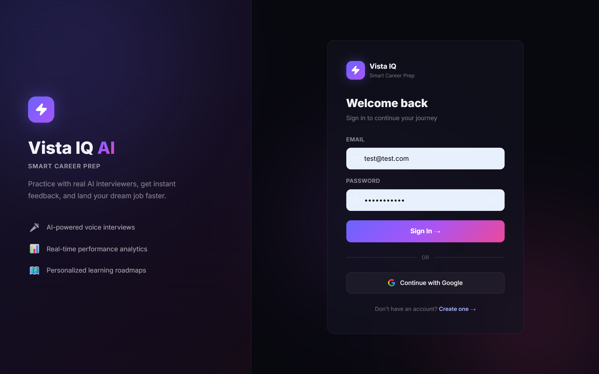

### Dashboard

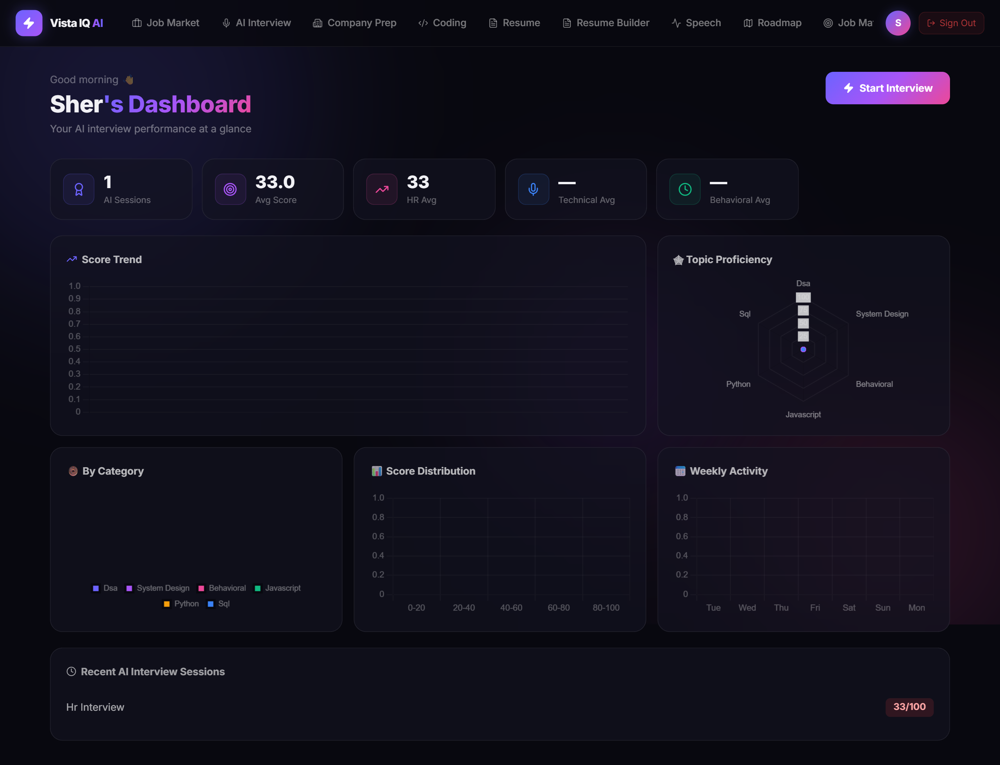

### Resume Builder

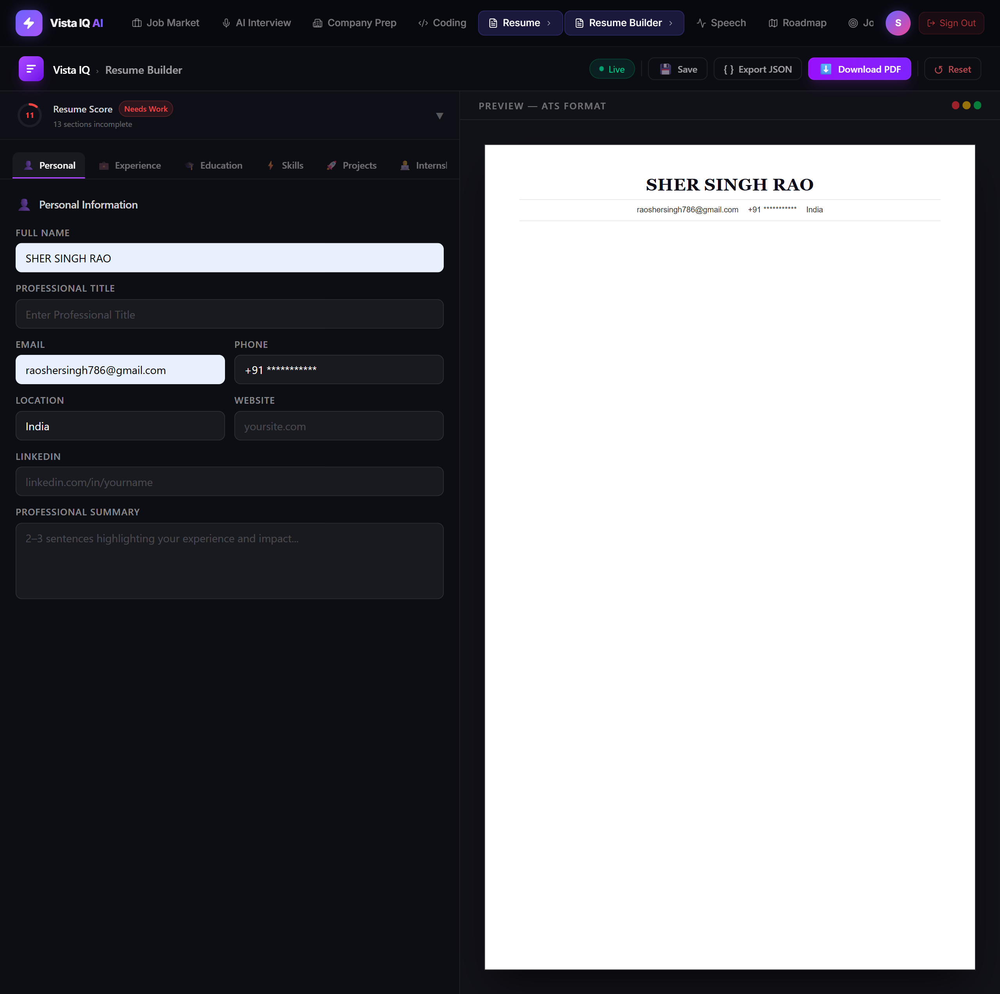

### Resume Analysis

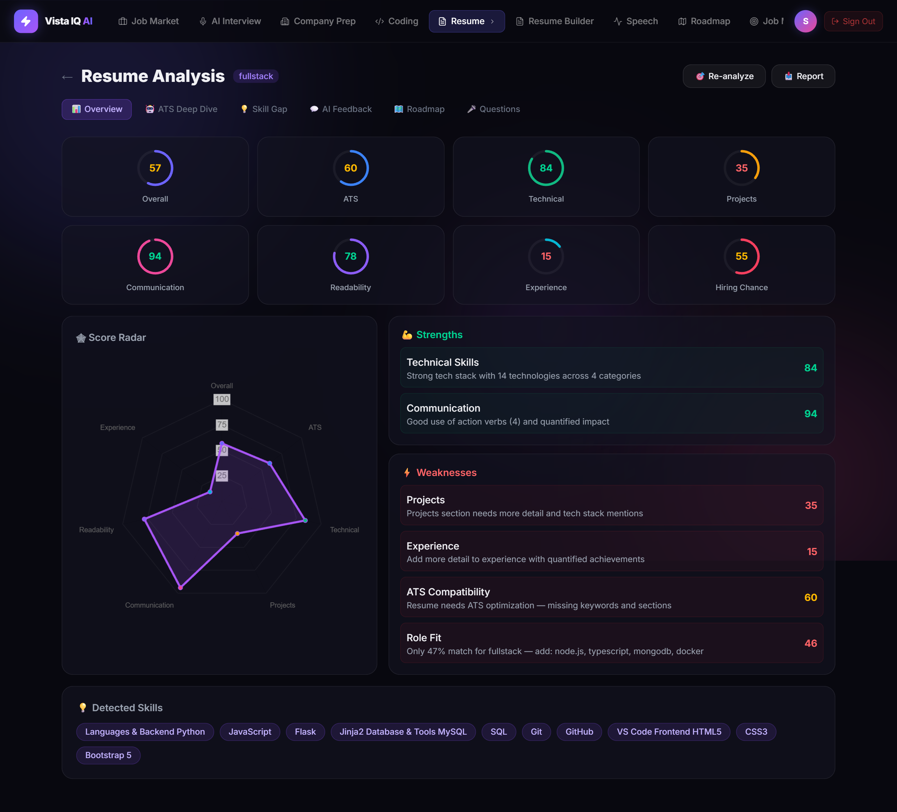

### AI Interview

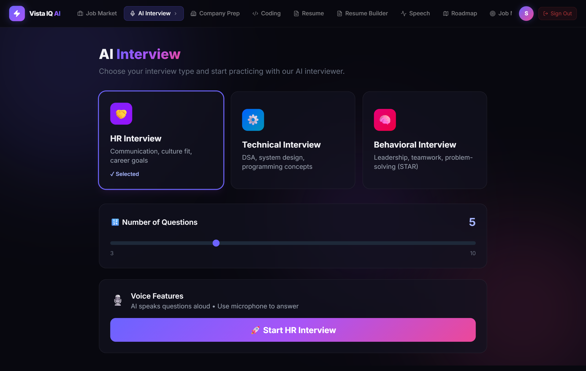

### Job Market

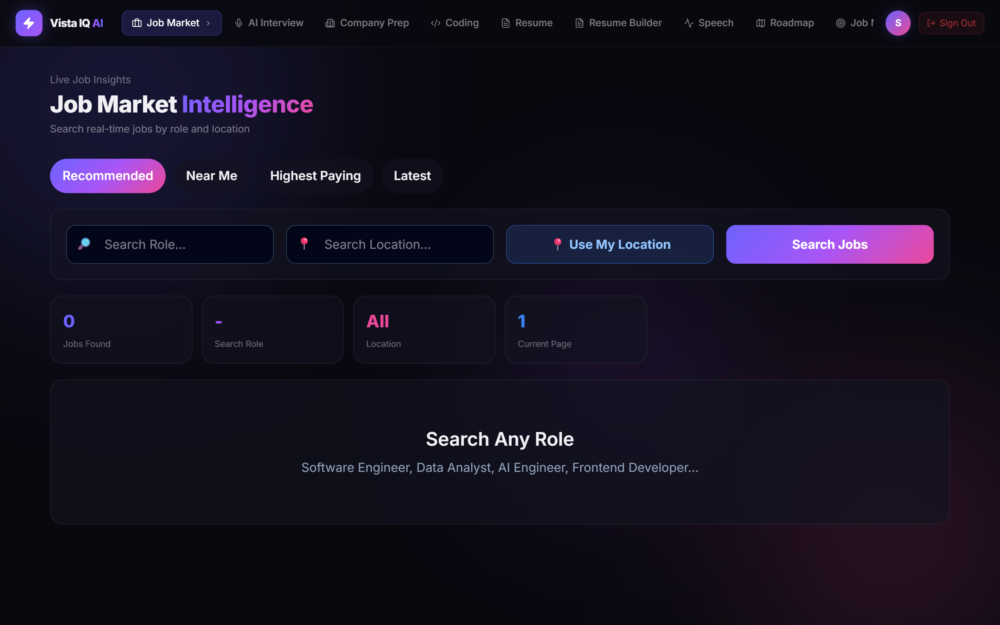

### AI Job Matching

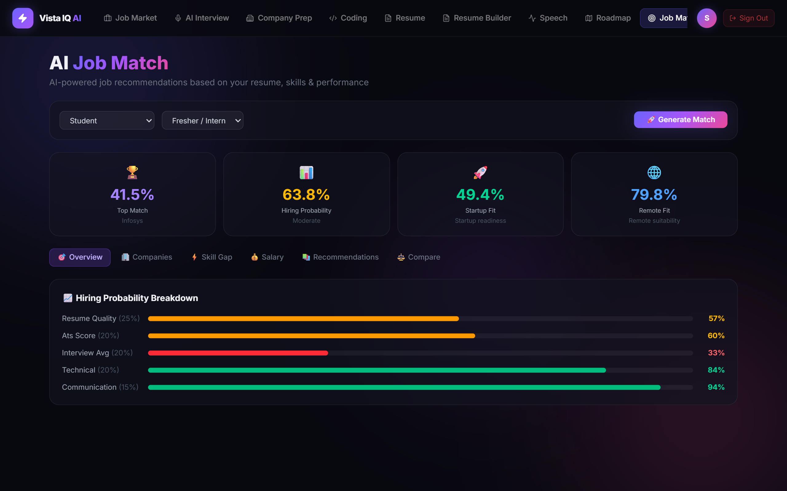

### Company-Specific Preparation

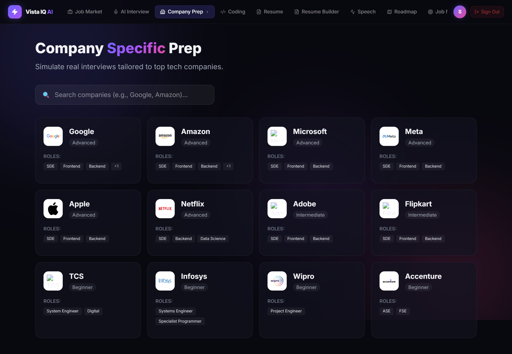

### AI Roadmap Generator

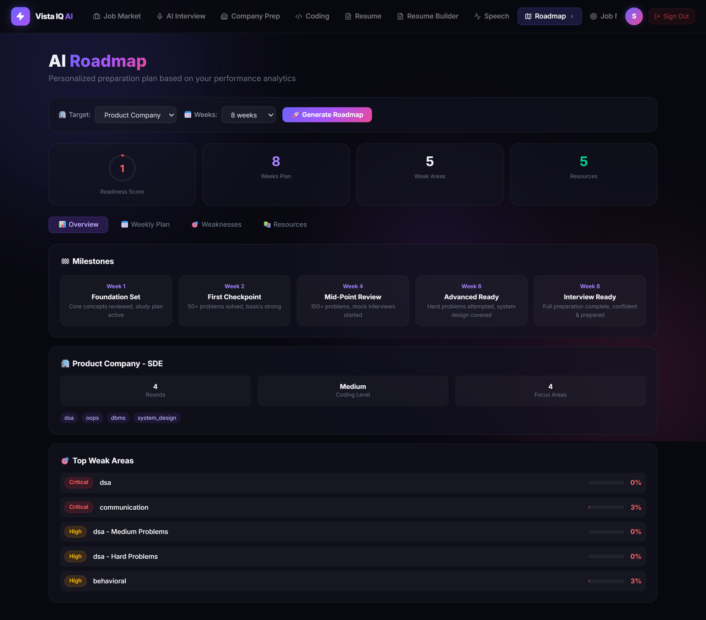

### User Profile

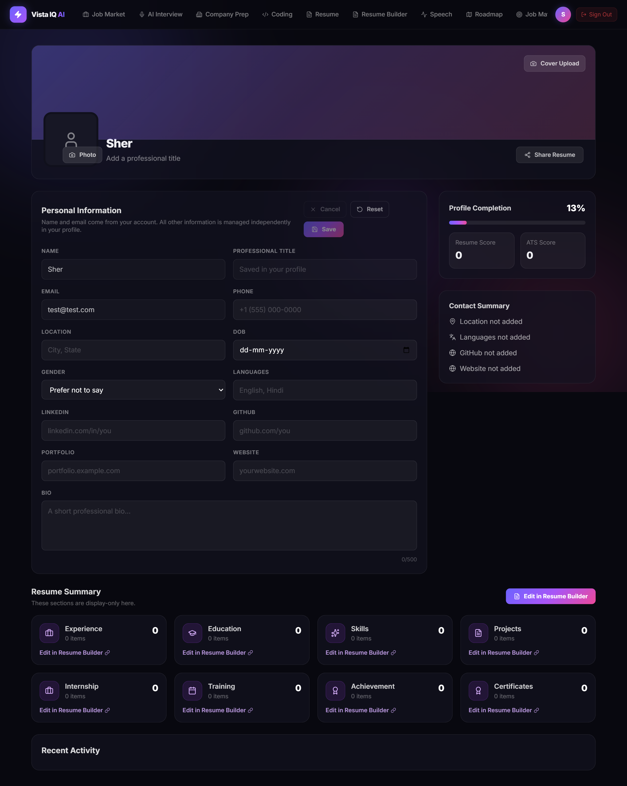

### Speech Confidence Analysis

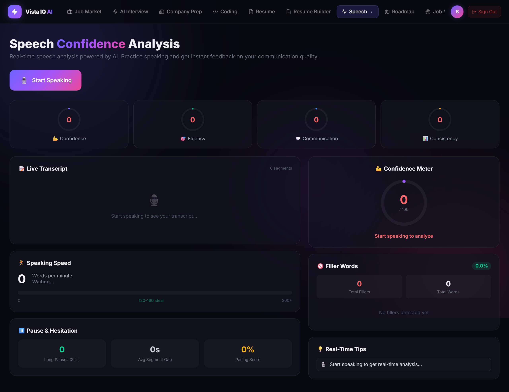

## License

This project is licensed under the MIT License. See [LICENSE](LICENSE) for details.
